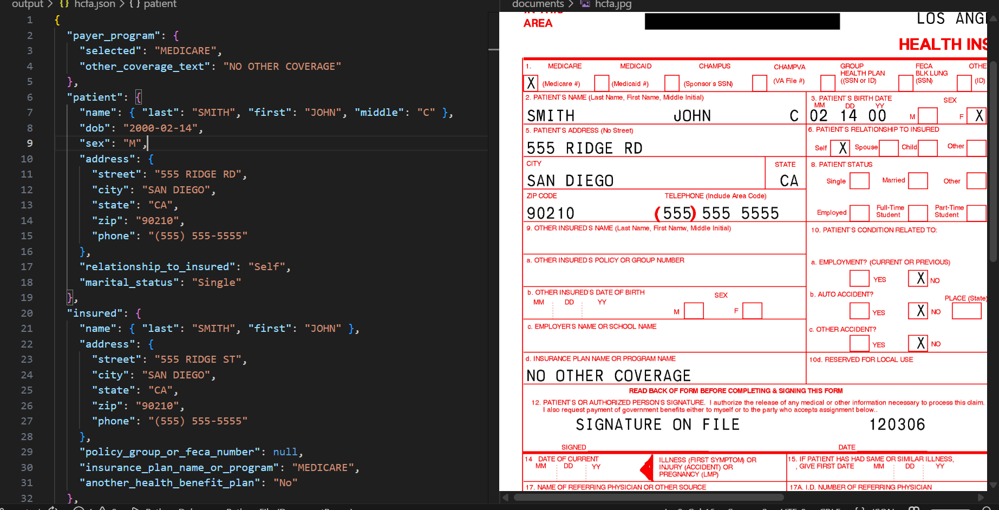
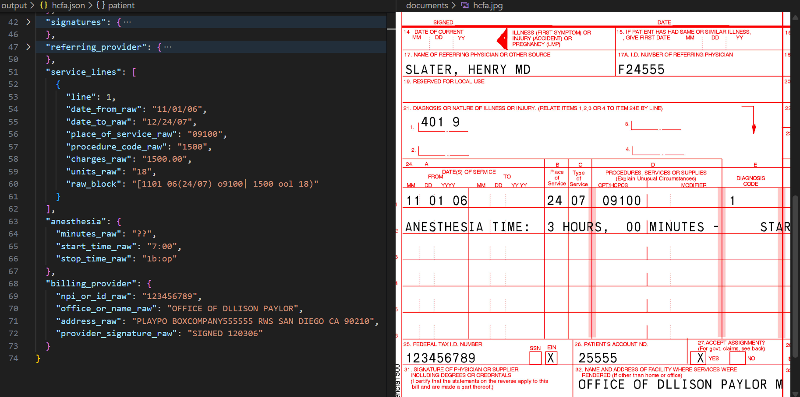

- document consumer
- document processor
- text extraction
- text parsing

https://pymupdf.readthedocs.io/en/latest/converting-files.html#files-to-pdf

heres a snippet of the .jpg



```python
import os
import pymupdf

# img to pdf
os.environ["TESSDATA_PREFIX"] = "C:/Program Files/Tesseract-OCR/tessdata"

jpg = pymupdf.open("documents/hcfa.jpg")
bytes = jpg.convert_to_pdf()
pdf = pymupdf.open("pdf", bytes)
pdf.save("stage/hcfa.pdf")
```

## consumer


```python
import pymupdf.layout
import pymupdf4llm
from pathlib import Path
import os

os.environ["TESSDATA_PREFIX"] = "C:/Program Files/Tesseract-OCR/tessdata"

doc = pymupdf.open("stage/hcfa.pdf")
md = pymupdf4llm.to_markdown(doc, header=False, footer=False)
txt = pymupdf4llm.to_text(doc, header=False, footer=False)

Path("output/hcfa.md").write_bytes(md.encode())
Path("output/hcfa.txt").write_bytes(txt.encode())

doc.close()


# promt = "parse this" (attach txt and md)
```

    === Document parser messages ===
    Full-page OCR on page.number=0/1.
    
    

[chatgpt 5.2 thinking output](../output/hcfa.json)
after attaching [parsed markdown](../output/hcfa.md) and [parsed txt](../output/hcfa.txt)

# [json output](../output/hcfa.json)


some comparisons


not useful as is


## processor

## extractor

## parser
